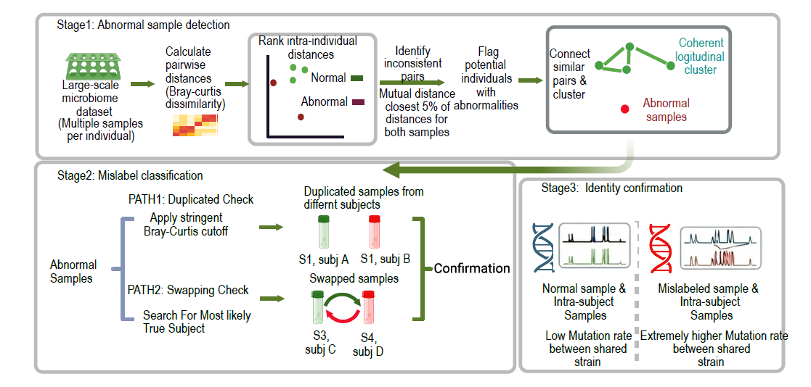

# Find-abnormality
## A longitudinal metagenomic framework for detecting abnormal, duplicated, and mislabeled samples



# Overview

This computational framework identifies sample-identity errors and abnormal microbiome profiles in longitudinal metagenomic studies.

Longitudinal microbiome studies rely on repeated sampling from the same individuals. However, sample swaps, duplicated samples, and metadata errors can introduce abnormal samples that compromise downstream analyses.

The framework integrates:

- Abnormality detection
- Mislabel classification
- Optional strain-level genomic confirmation

It is designed for large-scale metagenomic datasets and provides interpretable evidence for each flagged sample.

---

# Key features

## 1. Longitudinal abnormality detection

Stage 1 identifies samples that deviate from an individual's expected microbiome trajectory. It uses:

- Bray-Curtis dissimilarity
- Within-individual distance ranking
- Mutual nearest-neighbor relationships
- Graph-based clustering

These measures separate coherent longitudinal samples from potentially abnormal samples.

## 2. Mislabeled sample identification

Stage 2 detects two major types of sample-identity errors.

### Sample duplication

Samples from different individuals that show unexpectedly high similarity are flagged as possible duplicates. Potential causes include:

- Accidental sample reuse
- Duplicate submission
- Metadata-assignment errors

### Sample swapping

Samples potentially assigned to the wrong individual are identified by comparing:

- Microbiome similarity
- Longitudinal consistency
- Candidate-subject trajectories

## 3. Strain-level identity confirmation (optional)

Stage 3 cross-validates potentially abnormal or mislabeled samples using strain-specific mutation rates. Mutation-rate matrices are generated for each species-level genome bin (SGB) with StrainPhlAn 4. The abnormal sample is then compared with longitudinal samples assigned to the recorded individual and, when testing a proposed reassignment, with samples from the candidate individual.

A low mutation rate supports a shared strain origin, whereas consistently elevated mutation rates suggest that the samples originated from different individuals. Evidence from multiple organisms is preferred: in this framework, at least two shared SGBs with concordant mutation-rate patterns are required to support the same biological source.

# Installation

## Requirements

- Python 3.7+
- `numpy`
- `pandas`
- `scipy`
- `networkx`
- `matplotlib`
- `scikit-learn`

Install the Python dependencies with:

```bash
pip install numpy pandas scipy networkx matplotlib scikit-learn
```

# Usage: Stages 1 and 2

```bash
python find_abnormality.py abundance.tsv meta.tsv -s output_prefix [-c 0.3]
```

## Input-file examples

`abundance.tsv` (tab-delimited):

| | sample1 | sample2 | sample3 |
|---|---:|---:|---:|
| s__A | 2.5 | 4.2 | 0.0 |
| s__B | 0.0 | 1.3 | 0.9 |
| s__C | 1.1 | 0.0 | 2.2 |

`meta.tsv` (tab-delimited):

| sample_id | patient | batch |
|---|---|---|
| sample1 | PAT01 | batch_0 |
| sample2 | PAT01 | batch_1 |
| sample3 | PAT02 | batch_1 |

## Output-file guide

### 1. `<prefix>_mislabeled_sns.tsv`

Lists sample pairs within each patient that are flagged as mislabeled based on anomalous distances.

- `patient_id`: Patient or subject identifier
- `sample1`, `sample2`: Samples being compared
- `rank1`, `rank2`: Rank of the distance in each sample's distance vector
- `total_samples`: Number of samples for the patient
- `flag_type`: `mislabeled`

### 2. `<prefix>_cheating_sns.tsv`

Lists sample pairs within batches that are suspiciously similar and may represent duplicates.

- `batch`: Batch name or label
- `sample1`, `sample2`: Samples identified as possible duplicates
- `bray_curtis_distance`: Bray-Curtis distance between the samples
- `cheating_group`: Reporting group, such as `C1` or `C2`

### 3. `<prefix>_true_labels.tsv`

Suggests the most likely true patient partner for each sample identified as mislabeled.

- `mislabeled_sample`: Sample flagged as problematic
- `top_candidate_patient`: Patient with the lowest mean Bray-Curtis distance to the sample
- `distance_score`: Mean distance for the candidate
- `normal_samples`: Other normal samples assigned to the patient

### 4. `<prefix>.pkl`

Python pickle file containing intermediate results for advanced users or downstream analysis.

## Notes

- Output tables are tab-delimited and include header rows.
- `<prefix>` is set with `-s`; its default value is `results`.
- If only one batch is present, only the duplicate-detection output is generated.

# Usage: Stage 3

## Generate SGB mutation-rate matrices

For each SGB listed in the StrainPhlAn link file, run StrainPhlAn 4 with mutation-rate calculation enabled:

```bash
while read -r sgb; do
    clade="t__${sgb}"
    output_dir="output_LP/output_${clade}"

    mkdir -p "${output_dir}"

    strainphlan \
        -s consensus_markers/*.pkl \
        -m "db_markers/${clade}.fna" \
        -o "${output_dir}" \
        -n 40 \
        -c "${clade}" \
        --mutation_rates \
        --marker_in_n_samples 1 \
        --sample_with_n_markers 10 \
        --phylophlan_mode accurate
done < /storeData/zhouy/01_fenbaobao/public/PRJEB38984_analyses/strainphlan/link/batch_0_strain.link
```

The `--mutation_rates` option produces an SGB-specific pairwise mutation-rate matrix. The marker filters retain markers present in at least one sample and samples containing at least 10 markers.

## Sort and Creat abnormal candidates

Create a query file such as `abnormal_samples.tsv`:

| sample_id | recorded_patient | candidate_patient |
|---|---|---|
| W0020_3 | W0020 | W0075 |
| W0040_3 | W0040 | W0077 |
| W0082_3 | W0082 | W0083 |
| W0084_3 | W0084 | W0045 |
| W0090_3 | W0090 | W0039 |

Only `sample_id` is required. If `recorded_patient` is omitted, the script derives it from the portion of the sample ID before the first underscore. `candidate_patient` is optional.

## Visualize recorded- and candidate-patient mutation rates

The integrated `find_abnormality.py` generates one boxplot for each abnormal sample. The first box summarizes mutation rates between the abnormal sample and samples from its recorded patient. When `candidate_patient` is provided, the second box summarizes mutation rates between the abnormal sample and samples from that candidate patient. Individual observations are overlaid so that the number and distribution of SGB-level comparisons remain visible.

Mutation rates are displayed as `log10(mutations per 1,000 aligned positions)`. A dashed horizontal reference line marks 0.1 mutations per 1,000 sites, corresponding to `log10(0.1) = -1`. Rates equal to or below zero are omitted from the figure because their base-10 logarithm is undefined; the untransformed values remain available in the Stage 3 TSV output.

Run Stage 3 and generate PNG boxplots with:

```bash
python find_abnormality.py \
    --stage3-only \
    -s results \
    --stage3-mutation-glob '/path/to/output_LP/*/*.mutation' \
    --stage3-queries abnormal_samples.tsv \
    --stage3-output results_stage3_mutation_rates.tsv \
    --stage3-plot-dir results_stage3_boxplots
```

The default image format is PNG. Use `--stage3-plot-format pdf` or `--stage3-plot-format svg` for publication-oriented vector output. If `--stage3-plot-dir` is omitted, figures are written to `<suffix>_stage3_boxplots`.
Each figure is named `<sample_id>_mutation_rates.<format>`. Lower log10 values indicate greater strain similarity. The box shows the median and interquartile range, while overlaid points show the underlying comparisons across samples and shared SGBs.


## Interpretation

A low mutation rate between an abnormal sample and the other longitudinal samples from an individual supports a common strain origin. Consistently high mutation rates argue against that assignment. A same-origin conclusion should be supported by concordant evidence from at least two shared SGBs.

# License

MIT License

# Contact

zhouyong0530@outlook.com
